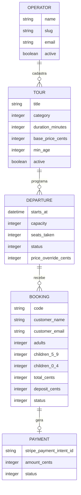

# Rota Velho Chico


Marketplace de passeios turísticos em Paulo Afonso (BA): agências cadastram
saídas com vaga limitada, turistas reservam e pagam 30% de sinal on-line, sem
precisar de conta.

Projeto de portfólio. **Não afiliado a nenhuma agência real de Paulo Afonso** —
os operadores, preços e disponibilidades são dados de demonstração. A cidade,
os passeios e o contexto turístico são reais; os dados cadastrais são
fictícios.

## Por que este projeto existe

Sistema de reserva com vaga limitada é um problema de concorrência de verdade,
não só CRUD. Duas pessoas podem tentar reservar a última vaga da mesma saída
no mesmo instante — o objetivo aqui foi construir e **provar** que isso não
gera overbooking, com um teste que sobe 20 threads reais disputando 10 vagas
e falha de propósito se o lock for removido (ver [`docs/architecture.md`](docs/architecture.md), seção 5).

## Stack

- **Ruby 3.4.10 / Rails 8.1**, monolito server-rendered (Turbo + Stimulus, sem SPA)
- **PostgreSQL 18** — necessário de verdade: `SELECT ... FOR UPDATE` é o que
  sustenta a garantia de não-overbooking; SQLite (escritor único) tornaria a
  demonstração trivial e sem graça
- **Stripe Checkout + Connect** para o sinal de 30%: destination charge
  repassa o valor pra conta conectada de cada operador, descontada a
  comissão da plataforma, com verificação de assinatura de webhook e
  idempotência
- **Devise** para o painel do operador, com autocadastro (`/operators/sign_up`)
  e aprovação manual antes da conta poder logar
- **Tailwind CSS v4** via `tailwindcss-rails`, sem build de JS separado
- **Solid Queue** para jobs assíncronos (estorno em cascata, e-mail)
- **RSpec + FactoryBot + Capybara**, cobertura mínima de 85% travada no CI
  (atualmente 100% linha/branch)
- **Kamal 2** para deploy em VPS única

## Modelo de dados



`STRIPE_EVENT` existe à parte, sem relação de negócio — só idempotência de
webhook. Colunas completas, constraints e o porquê de cada uma estão em
[`docs/architecture.md`](docs/architecture.md).

## Rodando localmente

Pré-requisitos: Ruby 3.4.10 (via [mise](https://mise.jdx.dev/) ou `rbenv`/`rvm`) e PostgreSQL 18 rodando localmente.

```bash
git clone git@github.com:TiagosailE/rota-velho-chico.git
cd rota-velho-chico
bin/setup
```

`bin/setup` instala as gems, prepara o banco (`db:prepare`) e sobe `bin/dev`
(servidor Rails + watcher do Tailwind) na porta 3000. Use `bin/setup --skip-server`
para só preparar o ambiente sem subir o servidor.

Popule dados de demonstração (4 agências, 6 passeios, 60 saídas nos próximos
90 dias):

```bash
bin/rails db:seed
```

Login do painel do operador em `/operators/sign_in`: qualquer e-mail semeado
(ex.: `contato@catamarapauloafonso.example.com`) + senha `password123`
— **senha de desenvolvimento, nunca usada em produção.**

Autocadastro em `/operators/sign_up` entra com `active: false` — sem
painel de administração, aprovar é `Operator.find_by(email:
"...").update!(active: true)` via `bin/rails console`.

### Variáveis de ambiente (opcionais em dev)

A aplicação funciona sem elas para navegar e reservar; só o pagamento de
verdade e o e-mail via SMTP externo dependem de credenciais:

```bash
bin/rails credentials:edit
```
```yaml
stripe:
  secret_key: sk_test_...
  webhook_secret: whsec_...
```

## Testes

```bash
bin/rspec                                          # suíte completa
bin/rspec spec/services/booking_creator_spec.rb    # um arquivo
COVERAGE_MIN=85 bin/rspec                          # falha se a cobertura cair abaixo do piso
bin/ci                                             # RuboCop + Brakeman + bundler-audit + importmap audit + RSpec
```

`bin/ci` roda exatamente o que o GitHub Actions roda em cada push — é o
mesmo comando usado para decidir se um PR está pronto para merge.

## Decisões de engenharia (resumo)

A lista completa com alternativas descartadas e o porquê está em
[`docs/architecture.md`](docs/architecture.md#8-decisões-e-trade-offs). Os
destaques:

| Decisão | Por quê |
|---|---|
| Lock pessimista (`SELECT ... FOR UPDATE`) em vez de otimista | Disputa por vaga é rara mas catastrófica; seção crítica é de microssegundos — não vale o retry de um lock otimista |
| `seats_taken` desnormalizado + `CHECK` constraint no banco | Um `COUNT` nas reservas a cada request não escala nem é lockável de forma limpa; a aplicação erra, o banco não |
| Sinal de 30% via Stripe, não pagamento integral | Realista para o mercado local e torna a política de estorno binária (devolve ou não), não escalonada |
| Snapshot de preço em cada reserva | Reserva de janeiro não pode mudar de valor porque o operador reajustou o passeio em março |
| Estorno em job assíncrono, fora da transação | Chamada de rede não pode segurar transação de banco; job falho é reprocessável, transação abortada no meio de 40 estornos não |
| Sem conta para o turista reservar | Quem reserva um passeio de barco não quer criar login — código de 6 caracteres + e-mail é suficiente para consultar depois |
| Aprovação de operador manual (`active: false` + console), não painel de admin | Trust/safety real do autocadastro sem construir um sistema de auth/role paralelo só pra isso — resolve o mesmo problema no tamanho certo pro estágio do projeto |

## Segurança

Turista não tem login — a credencial dele é um código de 6 caracteres mais o
e-mail —, e o painel do operador mexe em preço, cancelamento e estorno. O que
isso exige (HTTPS obrigatório, CSP montada a partir do que o site realmente
carrega, limite de tentativas nos endpoints públicos, segredo de seed fora do
repositório) e o que ficou deliberadamente em aberto está em
[`docs/security.md`](docs/security.md).

## Deploy

Kamal 2 em VPS única (Hetzner CX22), Postgres como accessory no mesmo host,
sem domínio na primeira fase (acesso direto por IP). Passo a passo completo
em [`docs/deploy.md`](docs/deploy.md).

Para subir uma versão de teste sem custo (com as limitações que isso traz),
ver [`docs/deploy-render.md`](docs/deploy-render.md).

## Estrutura do projeto

```
app/
  controllers/   # HTTP + Devise (painel do operador)
  models/        # validações, enums, associações -- sem regra de negócio
  services/      # regra de negócio: BookingCreator, PriceCalculator,
                 # RefundPolicy, DepartureCanceller, BookingCanceller
  views/         # ERB + Turbo Frames, sem SPA
  jobs/          # Solid Queue -- estorno e e-mail assíncronos
docs/
  architecture.md   # schema coluna a coluna, contratos, fluxos, decisões
  security.md       # modelo de ameaça, controles e o que ficou em aberto
  deploy.md         # passo a passo do deploy com Kamal
  deploy-render.md  # deploy de teste gratuito no Render
```

## Roadmap pós-MVP

Ordenado por retorno sobre esforço: Pix via Stripe (meio de pagamento
dominante no Brasil), almoço como add-on de verdade (hoje é só um booleano),
avaliações pós-passeio, painel de métricas do operador, exportação de lista
de embarque em PDF, alerta de vaga quando alguém cancela.
